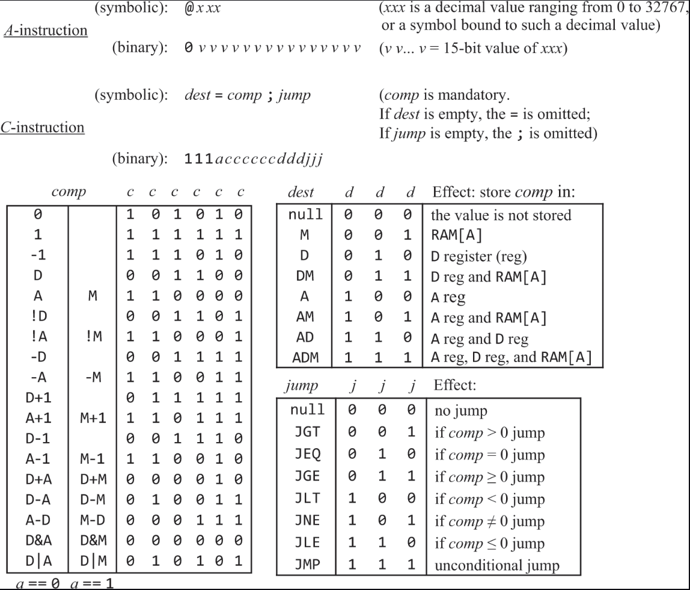

# Assembler for the Hack computer (The Elements of Computing Systems chap. 6)

This is a simple assembler written in Go for the hack computer described in chapter 6 of the book **The Elements of Computing Systems**

